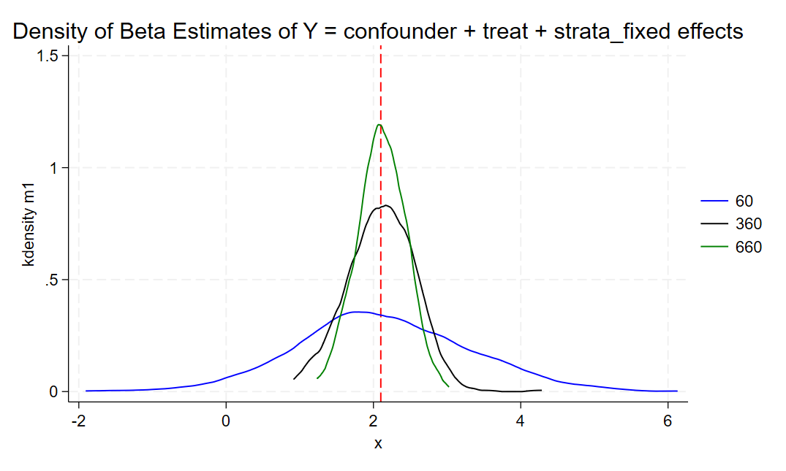
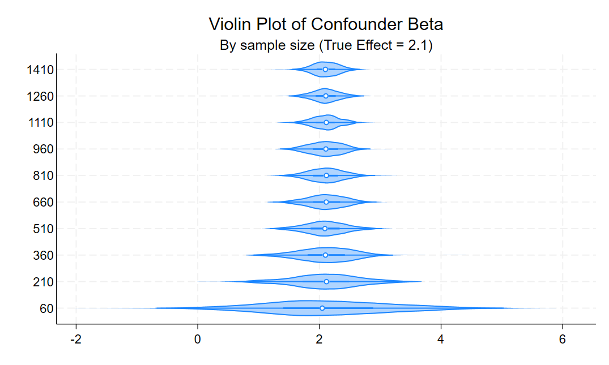

# Analysis of Model Covariates' Ability to Recover the True Effect (2.1) of the Confounder 

The true data generating process is:

$$
Y = \beta_1 \text{Confounder} + \beta_2 \text{Treatment} + \beta_3 (\text{Treatment} * \text{Treatment Effect}) + \text{Strata Fixed Effects}
$$

We first run a density plot of the estimated betas across three sample sizes 

The model we pull from m1 is denoted as such:

$$
\hat{Y} = \text{Confounder} + \text{Treatment} + \text{Strata Fixed Effects}
$$

### Overview  
- **Lines in different colors** represent different sample sizes:
  - **Blue (samp_size = 60):** We see a noticeably wider distribution, more spread around 2.1.  
  - **Black (samp_size = 360):** The distribution becomes tighter compared to 60, suggesting increased precision as the sample size grows irrespective of changing any controls.  
  - **Green (samp_size = 660):** This trend continues as we add another 300 obs to the sample.
    
---

This process is further driven home by the vilon plot which increminates from 60 to 1410 total obs. 

### Plot Description
- **Vertical Axis (sample sizes):** Ranges from smaller (60) at the bottom to larger (1,410) at the top in the provided figure.
- **Horizontal Axis:** The estimated effect of the confounder (again, `m1`).
- **Violin Shapes:** Show the density of estimates at each sample size. Wider sections indicate higher probability density of those estimates.
- **White Dot:** Commonly represents the median (or mean, depending on configuration) of the estimates at that sample size.
- **Reference line:** Dashed vertical line at **2.1**, the hypothesized (true) effect.

### Key Takeaways
1. **Narrowing of the Violin**  
   - As sample size increases, each violin becomes slimmer, illustrating a more precise estimate with less spread.
2. **Centering on 2.1**  
   - The center of the violin approaches **2.1** as the sample size increases, suggesting the estimator is consistent.
3. **Visual Comparison**  
   - Direct comparison of sample sizes on one plot makes it easy to see how the accuracy (closeness to 2.1) and precision (spread) improve with more data.

---

## 3. Interpretation & Implications

1. **Consistency & Precision**  
   - Both the density plot and violin plot suggest that as sample size grows, the model reliably recovers the true effect (**2.1**) with higher precision (narrower distributions).
2. **Impact of Covariates**  
   - By including `confounder`, `treat`, and `strata_fixed effects` in the model, we likely reduce omitted variable bias, aiding in correctly identifying the true parameter.  
   - The more comprehensive the model (and the larger the sample), the more centered around **2.1** the estimates appear.
3. **Practical Takeaway**  
   - Researchers can have greater confidence in estimated effects when sufficiently large samples are combined with relevant covariates that properly adjust for confounding.

---

## 4. Conclusion

From the density and violin plots, we observe that:

- **Smaller sample sizes** yield more dispersed estimates that still seem to cluster near 2.1 but with higher variability.
- **Larger sample sizes** progressively tighten the distribution around the true effect, confirming that the model is consistent and likely unbiased.
- **Inclusion of appropriate covariates** (the confounder, treatment indicator, and strata fixed effects) appears to help achieve estimates near the known true value.

In summary, these plots underscore the importance of both **adequate sample size** and **well-specified models with relevant covariates** to produce accurate and precise estimates of the true effect (2.1).

## Summary Table of Estimates

$$
\begin{array}{l|ccccc|ccccc|ccccc|ccccc|ccccc|ccccc|ccccc|ccccc|ccccc|ccccc|ccccc}
 & \multicolumn{5}{c}{60} & \multicolumn{5}{c}{210} & \multicolumn{5}{c}{360} & \multicolumn{5}{c}{510} & \multicolumn{5}{c}{660} & \multicolumn{5}{c}{810} & \multicolumn{5}{c}{960} & \multicolumn{5}{c}{1110} & \multicolumn{5}{c}{1260} & \multicolumn{5}{c}{1410} & \multicolumn{5}{c}{Total} \\[4mm]
 & m1 & m2 & m3 & m4 & m5 & m1 & m2 & m3 & m4 & m5 & m1 & m2 & m3 & m4 & m5 & m1 & m2 & m3 & m4 & m5 & m1 & m2 & m3 & m4 & m5 & m1 & m2 & m3 & m4 & m5 & m1 & m2 & m3 & m4 & m5 & m1 & m2 & m3 & m4 & m5 & m1 & m2 & m3 & m4 & m5 & m1 & m2 & m3 & m4 & m5 & m1 & m2 & m3 & m4 & m5 \\ \hline
\text{mean} & 2.13 & -0.13 & 2.10 & 2.12 & 2.10 & 2.10 & -0.10 & 2.10 & 2.10 & 2.10 & 2.10 & -0.10 & 2.10 & 2.10 & 2.10 & 2.09 & -0.11 & 2.10 & 2.10 & 2.10 & 2.11 & -0.10 & 2.10 & 2.11 & 2.10 & 2.11 & -0.09 & 2.10 & 2.11 & 2.10 & 2.10 & -0.10 & 2.10 & 2.10 & 2.10 & 2.10 & -0.10 & 2.10 & 2.10 & 2.10 & 2.10 & -0.10 & 2.10 & 2.10 & 2.10 & 2.10 & -0.09 & 2.10 & 2.10 & 2.10 & 2.11 & -0.10 & 2.10 & 2.10 & 2.10 \\[4mm]
\text{sd}   & 1.16 & 0.26 & 0.12 & 1.18 & 0.00 & 0.59 & 0.13 & 0.06 & 0.58 & 0.00 & 0.46 & 0.10 & 0.04 & 0.46 & 0.00 & 0.36 & 0.08 & 0.04 & 0.36 & 0.00 & 0.33 & 0.07 & 0.04 & 0.33 & 0.00 & 0.31 & 0.07 & 0.03 & 0.30 & 0.00 & 0.29 & 0.06 & 0.03 & 0.28 & 0.00 & 0.25 & 0.05 & 0.02 & 0.25 & 0.00 & 0.23 & 0.05 & 0.02 & 0.23 & 0.00 & 0.23 & 0.05 & 0.02 & 0.23 & 0.00 & 0.50 & 0.11 & 0.05 & 0.50 & 0.00 \\
\end{array}
$$

