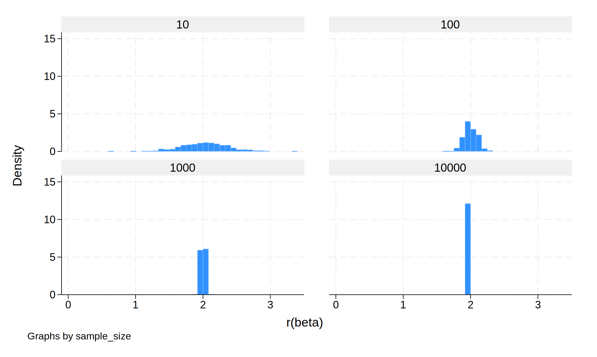
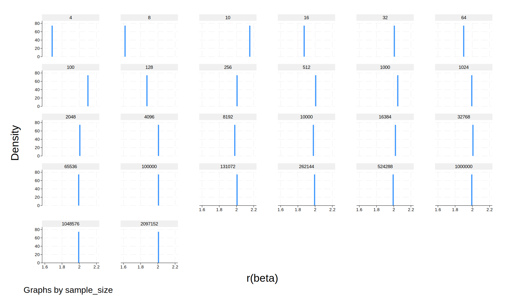
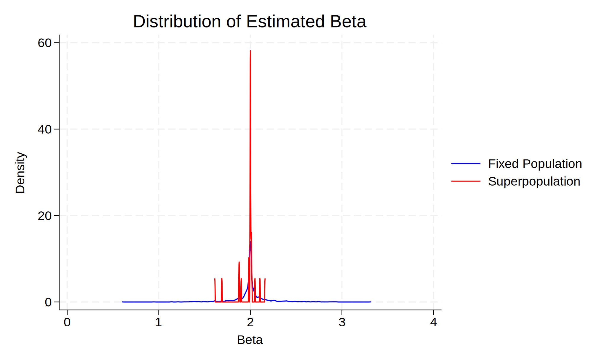

# Simulation Study: Fixed vs. Infinite Superpopulation

## **Overview**
We create a simple **data generating process (DGP)** in which:  
- `X` is drawn from a normal distribution: \( X \sim N(0,1) \)  
- `error` is drawn from a normal distribution.  
- The outcome variable is generated as:  
  \[
  Y = 2X + error
  \]
- This DGP is **identical** in both parts of the study.

## **Part 1: Sampling from a Fixed Population**
Here, **sampling noise** is introduced **only** due to random draws from a fixed dataset of 10,000 individuals.

(simulate: sim_fixed)

(13,000 real changes made)

(10,000 observations deleted)

### **Histogram of Beta Estimates (Finite Population)**
  
. histogram beta if fin == 1, by(sample_size) name(beta_finite, replace)

 

### **Summary Statistics (Finite Population)**

Summary statistics: Mean
Group variable: sample_size 

sample_size |      beta       sem    pvalue
------------+------------------------------
         10 |  2.028413  .3545535  .0031999
        100 |  1.999547  .1028508  2.15e-28
       1000 |  1.999711  .0321245         0
      10000 |  1.999519  .0101464         0
------------+------------------------------
      Total |  2.006798  .1249188     .0008
-------------------------------------------

## **Part 2: Sampling from an Infinite Superpopulation**
Here, each replication draws from an entirely **new dataset**, representing an **infinite** superpopulation.  

As expected, **standard errors (SE)** and **confidence intervals (CI widths)** **shrink as N increases**.

### **Histogram of Beta Estimates (Infinite Superpopulation)** 
. histogram beta if fin == 0, by(sample_size) name(beta_infinite, replace)

  

### **Summary Statistics (Infinite Superpopulation)**

Summary statistics: Mean
Group variable: sample_size 

sample_size |      beta       sem    pvalue
------------+------------------------------
          4 |  1.688837  .3245027  .0349935
          8 |  1.611786   .632024  .0434791
         10 |  2.161029  .4050121  .0006977
         16 |  1.875561  .1985752  1.89e-07
         32 |  2.009262  .1718558  1.07e-12
         64 |  1.900435  .1391581  2.36e-20
        100 |  2.104402    .10598  4.02e-36
        128 |  1.879525  .0854942         0
        256 |  2.010153  .0623596         0
        512 |  2.001355  .0445745         0
       1000 |  2.050527  .0298108         0
       1024 |  2.000215  .0299654         0
       2048 |  2.002115  .0227124         0
       4096 |  2.002847  .0156586         0
       8192 |  1.983195  .0112066         0
      10000 |  1.985734  .0100954         0
      16384 |  2.016072   .007827         0
      32768 |  2.011066  .0054821         0
      65536 |    1.9985  .0039158         0
     100000 |  2.002419  .0031568         0
     131072 |  2.001638  .0027567         0
     262144 |  1.997597  .0019535         0
     524288 |  1.999333  .0013814         0
    1000000 |  1.999234  .0009988         0
    1048576 |  1.999353  .0009753         0
    2097152 |   2.00182  .0006907         0
------------+------------------------------
      Total |  1.972847  .0891586   .003045
-------------------------------------------

---

## **Comparing Fixed vs. Infinite Sampling**
When sampling from a **fixed population** at `N = 10,000`, the **variation in estimates is limited** by the finite underlying variability of the dataset.  

In contrast, the **infinite superpopulation** case exhibits a smoother trend as `N` grows.

### **Density Plot: Finite vs. Infinite** 
. twoway (kdensity beta if fin == 1, lcolor(blue)) ///
>        (kdensity beta if fin == 0, lcolor(red)), ///
>        legend(order(1 "Fixed Population" 2 "Superpopulation")) ///
>        title("Distribution of Estimated Beta") xtitle("Beta") ytitle("Density") ///
>        name(beta_density, replace)

Below we can compare the mean overall values between the infinite and finite population

Summary statistics: Mean
Group variable: fin 

     fin |      beta       sem    pvalue
---------+------------------------------
       0 |  1.972847  .0891586   .003045
       1 |  2.006798  .1249188     .0008
---------+------------------------------
   Total |  1.977373  .0939266  .0027457
----------------------------------------

## **Conclusion**
- The **infinite superpopulation** has **smaller standard errors and tighter confidence intervals** as `N` increases.
- The **finite population** has more erratic estimates at **small sample sizes** due to **sampling constraints**.
- Larger sample sizes **reduce confidence interval width**, improving precision.

---
